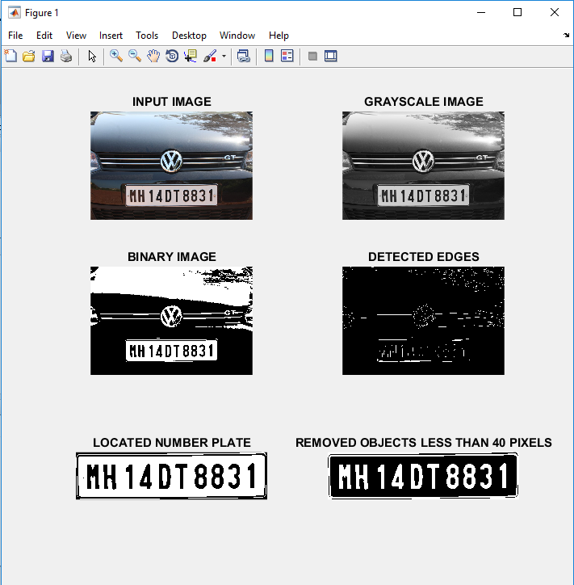
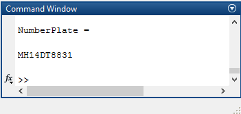

# Car-Number-Plate-Recognition-with-MATLAB
At first RGB to gray-scale conversion is adopted for the input image by rgb2gray() function, to facilitate the plate extraction, and increase the processing speed. The basic step in the recognition of a vehicle number plate is to detect the plate size. In general number plates are rectangular, hence it is necessary to detect the edges of the rectangular plate. That's why the image is converted to a binary image by the im2bw() function and graythresh() function is used to calculate the threshold from the grayscale image. Prewitt edge detector detects the edges from the grayscale image. Then it's become easier to locate the region of the number plate and crop it from the rest of the image. The regionprops() function measures properties of the image region and numel() function provide the number of array elements to set the number of iterations of the loop. Finally, the location of the image is stored in a multidimensional boundingBox array. Then a simple imcrop() function crops the number plate area according to boundingBox array. The bwareaopen() function removes the small objects from the binary image. Finally, Letter_Detection() function reads the letters corresponding to the binary image, and the appending of every subsequent character is stored in the NumberPlate array. The NumberPlate array is printed in the command window. This is how the number plate of a car is recognized after several precess.

